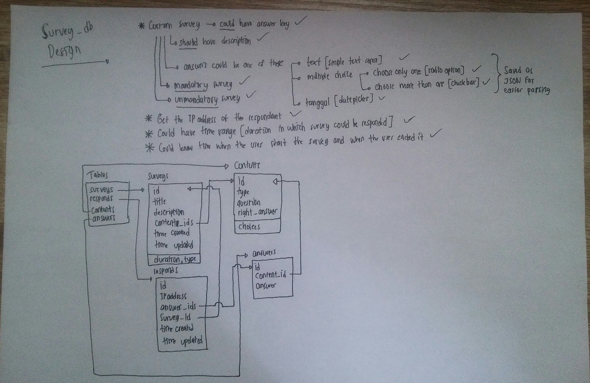

# Survey App

`English :` 
> Application that based on idea to make a custom survey or indeed something like **google form**

`Indonesia :` 
> Aplikasi yang didasarkan oleh ide untuk membuat survei kustom semacam **google form**

## Tech Stack

Here are some of tech stack i used for this project :
- [Laravel](https://laravel.com/)
- [Tailwind CSS](https://tailwindcss.com/)
- [MySQL](https://www.mysql.com/)

## Requirements

- XAMPP (Dibutuhkan untuk percobaan lokal)
- Composer v1.9.3 ^
- Node JS v10.16.0 ^
- NPM v6.9.0 ^
- PHP v7.4.2 ^

Note : `^` = versi sama atau diatasnya

## Installation Walkthrough

1. Clone repository ini dengan menggunakan command berikut
    ```bash
    git clone https://github.com/fakhrip/survey-app.git
    ```
2. Selanjutnya masuk ke dalam directory dari repo tersebut
    ```bash
    cd survey-app/
    ```
3. Buat database terlebih dahulu pada aplikasi XAMPP dengan nama `survey_db` dan jenis `Collation` pada http://localhost/phpmyadmin/
4. Copy file `.env` dari directory awal ke directory `app`
    ```bash
    cp .env app/
    ```
5. Ubah beberapa konfigurasi pada file `.env`
    ```
    APP_NAME=SurveyApp
    DB_DATABASE=survey_db
    ```
6. Install seluruh dependency didalam directory `app`
    ```bash
    cd app/
    composer install
    npm install
    ```
7. Generate key baru untuk aplikasi nya 
    ```bash
    php artisan key:generate
    ```
8. Gunakan command berikut untuk menjalankan aplikasi
    ```bash
    php artisan serve
    ```
8. **[OPTIONAL]** Kalau anda ingin mendevelop aplikasi ini gunakan command berikut agar setiap perubahan yang dilakukan bisa langsung mempengaruhi aplikasi
    ```bash
    npm run watch
    ```
9. Gunakan command berikut untuk menginisialisasi aplikasi serta membuat akun admin pada console yang anda gunakan
    ```bash
    php artisan init:app
    ```
10. Buka aplikasi pada link http://127.0.0.1:8000/

## What if error happened ?

- Pastikan MySQL dan Apache pada XAMPP sudah dalam keadaan nyala
- Pastikan Sudah mendownload Composer pada link berikut https://getcomposer.org/download/
- Pastikan PHP yang terinstall versi 7.4.2 ^ (terbaru 25/02/2020)
    ```shell
    PS H:\survey-app\app> php -v     
    PHP 7.4.2 (cli) (built: Jan 21 2020 17:52:43) ( ZTS Visual C++ 2017 x64 )
    Copyright (c) The PHP Group
    Zend Engine v3.4.0, Copyright (c) Zend Technologies
    PS H:\survey-app\app> 
    ```
- Pastikan Node JS yang terinstall versi 10.16.0 ^
    ```shell
    PS H:\survey-app\app> node -v
    v10.16.0
    PS H:\survey-app\app>
    ```
- Pastikan NPM yang terinstall versi 6.9.0 ^
    ```shell
    PS H:\survey-app\app> npm -v
    6.9.0
    PS H:\survey-app\app>
    ```

## Im a developer and need to know about the DB

Sure, here you go :
